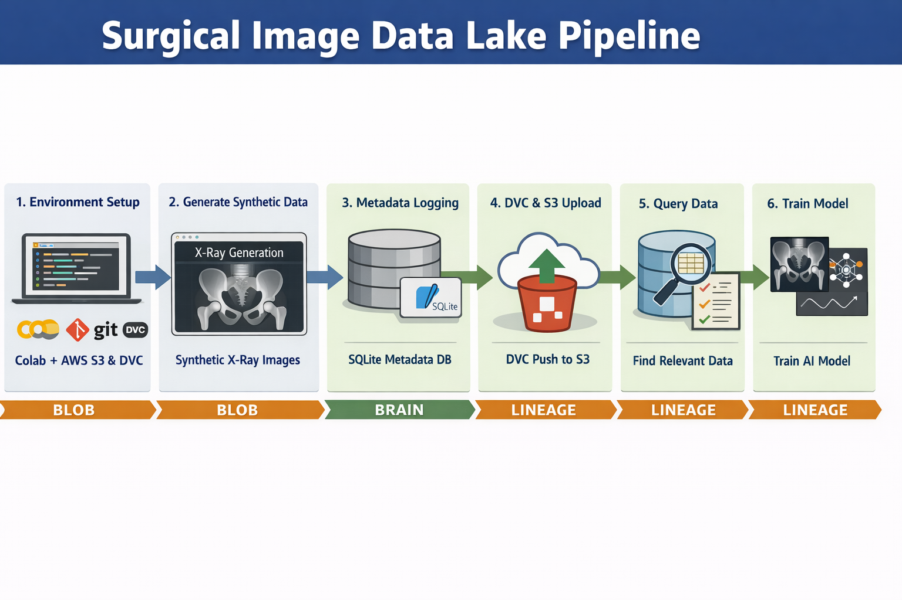

# 🏥 Surgical Image Data Lake – End-to-End MLOps Pipeline (PoC)

This repository demonstrates a **production-style data pipeline** for managing synthetic surgical imaging data, designed to scale from research experiments to regulated clinical AI systems.

The goal of this project is to show **how surgical imaging data can be generated, stored, tracked, queried, and used for AI training** in a way that is:

- ✅ Scalable  
- ✅ Reproducible  
- ✅ Secure  
- ✅ Business- and compliance-aware  

This is **not just a model demo** — it is a **systems-level MLOps proof-of-concept**.

---

## 📌 High-Level Architecture



At a high level, the pipeline follows a **Blob–Brain–Lineage** architecture:

| Layer | Purpose | Technology |
|------|--------|------------|
| **Blob** | Durable storage for large image files | Amazon S3 |
| **Brain** | Searchable metadata & clinical attributes | SQLite (upgradeable to PostgreSQL/RDS) |
| **Lineage** | Reproducibility & traceability of data | DVC + Git |

This separation ensures that **large binary data**, **structured metadata**, and **version history** are each handled by the right tool.

---

## 🎯 What This Project Demonstrates

- How to **generate synthetic surgical X-ray images** safely (no patient data)
- How to **store images in cloud object storage (S3)**
- How to **log clinical metadata** (e.g. pelvic tilt, anatomy, view)
- How to **query datasets using SQL**, not folder names
- How to **reproduce exact datasets** used for model training
- How to present the pipeline to **both technical and business audiences**

---

## 🧱 Pipeline Steps (Conceptual Overview)

### 1️⃣ Secure Environment Setup
We start by securely configuring the runtime environment (Google Colab or local):

- No credentials are hard-coded  
- AWS access keys are injected via environment variables  
- This aligns with security and compliance best practices  

**Why it matters:**  
Protects IP, prevents accidental leaks, and supports regulated environments.

---

### 2️⃣ Synthetic Surgical Image Generation
We generate **realistic synthetic AP pelvic X-rays** with controlled clinical parameters:

- Anatomy: Hip (AP view)  
- Clinical label: Pelvic tilt (degrees)  
- Physics-inspired noise model  

**Why it matters:**  
Synthetic data enables rapid scaling **without privacy risk** and reduces dependency on limited real-world datasets.

---

### 3️⃣ Metadata Logging (“The Brain”)
Each generated image is logged into a **structured metadata database**:

- Image ID  
- Anatomy & view  
- Clinical labels (e.g. pelvic tilt)  
- S3 location  

This turns raw files into a **queryable dataset**, not a data swamp.

**Why it matters:**  
Teams can ask *questions* instead of browsing folders:  
> “Give me all hip images with pelvic tilt > 15°”

---

### 4️⃣ Cloud Storage & Version Control
Image files are stored in **Amazon S3** and tracked using **Data Version Control (DVC)**:

- Data is never overwritten  
- Every dataset version is recoverable  
- Exact training data can be reproduced at any time  

**Why it matters:**  
Critical for debugging, audits, regulatory review, and long-term trust.

---

### 5️⃣ Smart Data Selection
Instead of manual file selection:

- SQL queries define training cohorts  
- Only relevant data is loaded  
- No duplication or guesswork  

**Why it matters:**  
Faster iteration, fewer errors, and better experimentation discipline.

---

### 6️⃣ Model Training & Downstream Use
Curated datasets feed directly into AI workflows:

- Model training  
- Validation  
- Analytics  
- Continuous improvement  

**Why it matters:**  
Better data → better models → safer clinical outcomes.

---

## 📂 Repository Structure

```text
surgical-image-data-lake-poc/
├── README.md
├── requirements.txt
├── notebooks/
│   └── 01_end_to_end_colab_demo.ipynb
├── src/
│   ├── generator.py        # Synthetic X-ray generator
│   ├── metadata_store.py  # SQLite metadata layer
│   ├── s3_io.py            # S3 upload utilities
│   └── train_demo.py       # Example training hook
├── scripts/
│   ├── ingest_batch.py     # Batch ingestion pipeline
│   └── query_cohort.py     # SQL-based data selection
├── schemas/
│   └── sqlite_schema.sql
└── docs/
    ├── pipeline.png        # Architecture diagram
    └── slides/
        ├── technical_deck.pptx
        └── business_deck.pptx

## 🚀 Quick Start (Colab)

1. **Clone the repository**
   ```bash
   git clone https://github.com/<your-username>/surgical-image-data-lake-poc.git
   cd surgical-image-data-lake-poc


2. **Open the Colab notebook**

   * Upload or open `notebooks/01_end_to_end_colab_demo.ipynb` in Google Colab.

3. **Set AWS credentials (securely)**

   * In Colab, open **Secrets** (🔑 icon on the left sidebar).
   * Add:

     * `AWS_ACCESS_KEY_ID`
     * `AWS_SECRET_ACCESS_KEY`
   * (Optional) Add `AWS_DEFAULT_REGION` if not using `us-east-1`.

4. **Create / choose an S3 bucket**

   * Create an S3 bucket in AWS (e.g., `my-surgical-datalake`).
   * Ensure your IAM user has `s3:GetObject`, `s3:PutObject`, and `s3:ListBucket` permissions.

5. **Set the bucket name**

   ```bash
   export S3_BUCKET=my-surgical-datalake
   ```

6. **Run the notebook top-to-bottom**

   * The notebook will:

     * Generate synthetic X-ray images
     * Upload images to S3
     * Log metadata to SQLite
     * Query cohorts via SQL
     * Load a curated dataset for training

**Expected outputs**

* Synthetic images generated locally
* Images uploaded to S3
* `surgical_metadata.db` populated
* Example SQL queries returning image cohorts
* Dataset ready for model training

---

## 📈 How This Scales in Production

This PoC maps cleanly to production systems:

| PoC Component    | Production Upgrade       |
| ---------------- | ------------------------ |
| SQLite           | Amazon RDS (PostgreSQL)  |
| Colab            | Kubernetes / EC2         |
| Manual ingestion | Airflow / Step Functions |
| Local scripts    | CI/CD pipelines          |
| Synthetic only   | Hybrid real + synthetic  |

---

## 🧠 Why This Matters (Business Perspective)

**Without this pipeline**

* Data becomes untraceable
* Experiments cannot be reproduced
* Regulatory risk increases
* Engineering velocity slows

**With this pipeline**

* Data is reliable and auditable
* Models are reproducible
* Teams iterate faster
* AI systems are safer and more trustworthy

---

## 👤 Author

**Atabak (Austin) Eghbal**
Machine Learning Engineer / Researcher
Focus: Medical AI, Computer Vision, MLOps

---

## 📝 License

MIT License (for demo and educational purposes)

